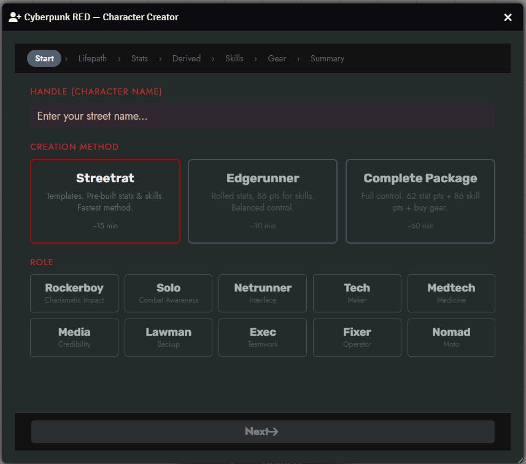
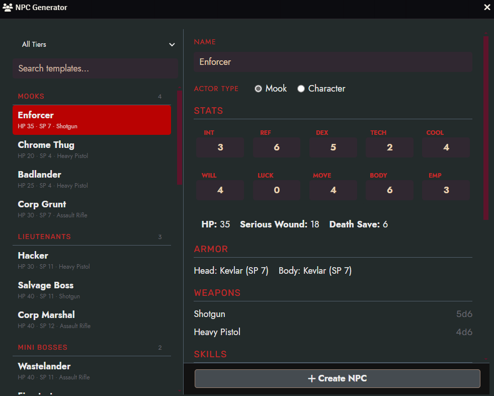
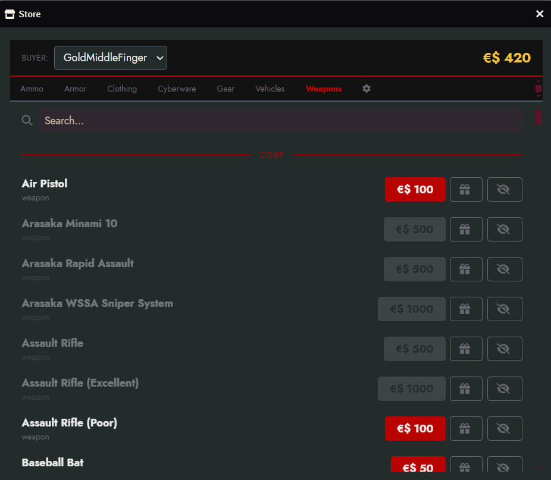
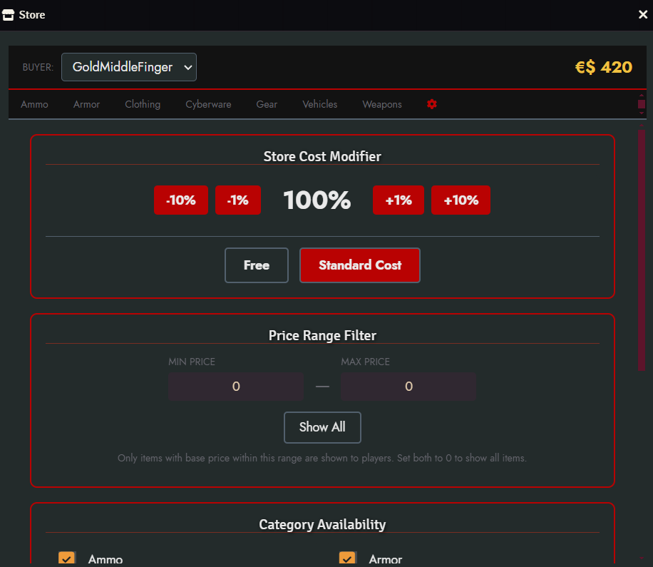

# Cyberpunk RED Wizards

A Foundry VTT module for **Cyberpunk RED** that adds a step-by-step **Character Creator**, a one-click **NPC Generator**, and an in-game **Store** for buying equipment.

Requires the [Cyberpunk RED - CORE](https://gitlab.com/cyberpunk-red-team/fvtt-cyberpunk-red-core) system and the [socketlib](https://github.com/manuelVo/foundryvtt-socketlib) module.

---

## Character Creator

A guided wizard that walks players through the full character creation process from handle to gear.



**Three creation methods:**

| Method | Description | Time |
|--------|-------------|------|
| **Streetrat** | Pre-built stat & skill templates. Fastest way to get playing. | ~15 min |
| **Edgerunner** | Rolled stats with 86 skill points to distribute. Balanced control. | ~30 min |
| **Complete Package** | Full control — 62 stat points, 86 skill points, and manual gear purchases. | ~60 min |

**Steps:** Start → Lifepath → Stats → Derived → Skills → Gear → Summary

- All 10 roles supported (Rockerboy, Solo, Netrunner, Tech, Medtech, Media, Lawman, Exec, Fixer, Nomad)
- Lifepath tables with roll-or-choose for each entry
- Automatic derived stat calculation (HP, Serious Wound, Death Save, Humanity, Walk/Run)
- Skill point allocation with x2-cost skill tracking
- Role-specific gear presets with alternatives, or manual budget-based purchasing
- Validation checklist on the summary page before final creation
- Creates a fully populated actor with all stats, skills, equipment, and cyberware

Access via the **Character Creator** button in the Actors sidebar.

---

## NPC Generator

Instantly create combat-ready NPCs from pre-built templates organized by threat tier.



**Tiers:**

- Regular Civilians
- Mooks / Hardened Mooks
- Lieutenants / Hardened Lieutenants
- Mini Bosses / Hardened Mini Bosses
- Boss

Each template includes pre-configured stats, armor, weapons, skills, cyberware, and equipment. Customize the name and choose between Mook or Character actor type before creating.

Search and filter templates by tier. Preview the full stat block before committing.

Access via the **NPC Template** button in the Actors sidebar.

---

## Store

A shared shopping interface where players browse and buy equipment from the system's compendium packs. Purchases are deducted from the character's Eurodollars automatically.



**Player features:**
- Browse items by category: Ammo, Armor, Clothing, Cyberware, Gear, Programs, Upgrades, Vehicles, Weapons
- Search across all items
- Items grouped by source (Core, Black Chrome, DLC, World)
- Buy with confirmation dialog showing balance before and after

**GM controls** (settings tab inside the Store):



- **Cost modifier** — adjust all prices globally (percentage-based, or set to free)
- **Price range filter** — restrict which items are visible by price
- **Category availability** — enable/disable entire item categories
- **Hide individual items** — remove specific items from the store
- **Exclude compendium packs** — hide entire packs (configured in module settings)
- **Loot mode** — GMs can add items to characters for free

Access via the **Store** button in the Items sidebar.

---

## Installation

1. In Foundry VTT, go to **Settings → Manage Modules → Install Module**
2. Paste the manifest URL and click **Install**:
   ```
   https://github.com/sudo-sein/cyberpunk-red-wizards/releases/latest/download/module.json
   ```
3. Enable **Cyberpunk RED Wizards** in your world's module settings

### Requirements

| Dependency | Minimum Version |
|------------|----------------|
| Foundry VTT | v12 |
| Cyberpunk RED - CORE | 0.92 |
| socketlib | 1.0.10 |

## Languages

- English
- Polish (Polski)

## License

See [LICENSE](LICENSE) for details.
